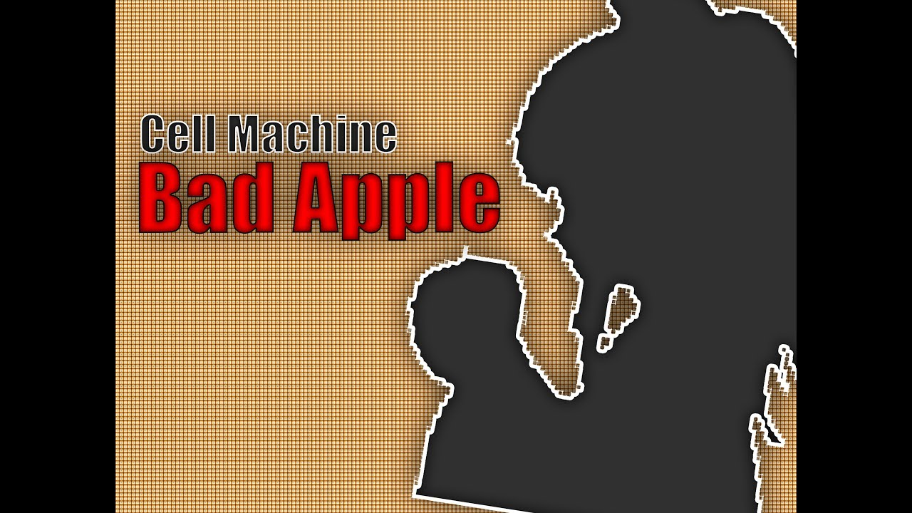
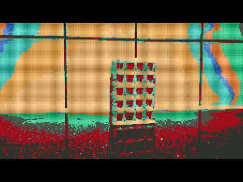

# CellVID

Turn video frames into mosaics made from Cell Machine sprites, then stitch them back into a video.

| Bad Apple                                                                                                   | Waffle falls over                                                                                                |
| ----------------------------------------------------------------------------------------------------------- | ---------------------------------------------------------------------------------------------------------------- |
| [](https://www.youtube.com/watch?v=GOGt6hSMo48) | [](https://www.youtube.com/watch?v=v7EoLHy85lQ) |

Click a preview to watch the demo.

## Usage

The original script uses legacy Python/Pillow APIs. Install the dependencies in `requirements.txt` in a compatible environment, then:

```sh
mkdir -p frames out
python3 main.py input.mp4
```

Output: `output.mp4`. Optional arguments control frame rate, render size and threads.

Built by [William Jackson](https://github.com/williamjaackson), originally released as **itskegnh**. Please credit CellVID and link this repository when sharing its output.
